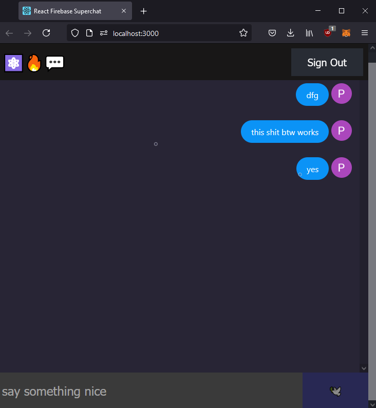

# React Firebase Super Chat

A simple fullstack chat demo with React and Firebase. 
Watch on full [React Firebase Chat Tutorial](https://youtu.be/zQyrwxMPm88) on YouTube. 
[Live demo](https://fireship-demos.web.app/)


# running locally with google auth and db connection


# Usage

Clone
```bash
npm install
```
create auth.js
add auth info from firebase website to that file

never make your auth token open to the internet

TODO how to really store api key in a safe plase when publishing the app

used this in firebase config for test reasons

```
// Allow read/write access on all documents to any user signed in to the application
service cloud.firestore {
  match /databases/{database}/documents {
    match /{document=**} {
      allow read, write: if request.auth != null;
    }
  }
}
```
